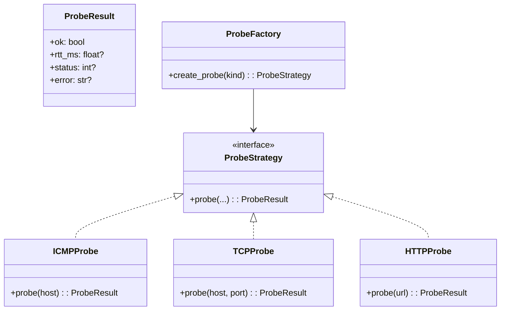

# 🧱 DesignPatterns-NetGuard  
Repositório da N1 do 2º Bimestre da disciplina **Arquitetura de Software — Fundação Salvador Arena (FESA) — 2025**  
Professor: *Gabriel Lara Baptista*  
Grupo: **NetGuard – Grupo 7**

---

## 🧩 Introdução

Os **Design Patterns (Padrões de Projeto)** são soluções consolidadas para problemas recorrentes no design de software.  
Eles não são código pronto, mas **modelos reutilizáveis** que orientam o desenvolvimento de sistemas **mais coesos, escaláveis e fáceis de manter**.

> “Padrões arquiteturais ajudam. Princípios de design ajudam.  
> Hoje todo mundo quer ser ágil, mas também é preciso ser inteligente.”  
> — *Ivar Jacobson*

---

## 🧠 Classificação dos Design Patterns

Os padrões de projeto são tradicionalmente classificados em **três categorias**:

| Categoria | Foco | Exemplos |
|------------|------|-----------|
| **Criacionais** | Controlam o processo de criação de objetos | Singleton, Factory Method, Abstract Factory, Builder, Prototype |
| **Estruturais** | Definem como as classes e objetos se organizam | Adapter, Facade, Composite, Decorator, Proxy, Bridge |
| **Comportamentais** | Definem como os objetos interagem entre si | Strategy, Observer, Command, Template Method, State, Chain of Responsibility |

📚 **Fonte:** [Refactoring.Guru – Design Patterns](https://refactoring.guru/design-patterns/classification)

---

## 💡 Padrões Escolhidos

No contexto do **NetGuard** — uma plataforma proativa de monitoramento e rastreabilidade de incidentes de rede —  
foram aplicados **dois padrões principais** que reforçam a modularidade e extensibilidade da arquitetura:

---

### ⚙️ 1. Strategy (Comportamental)

**Problema:**  
O sistema precisava realizar diferentes tipos de sondagem (ICMP, TCP, HTTP). Isso deixava o código cheio de condicionais `if/elif`, violando princípios de design limpo.

**Solução:**  
Encapsular cada tipo de sonda em uma *estratégia intercambiável*, todas herdando da interface `ProbeStrategy`.  
Isso permite alternar dinamicamente o tipo de monitoramento sem modificar o código principal.

**Benefícios:**
- Baixo acoplamento entre os tipos de sonda  
- Facilidade para adicionar novos protocolos (DNS, SNMP etc.)  
- Testabilidade e extensibilidade  

**Trade-offs:**
- Maior número de classes e abstrações, aumentando a complexidade inicial

---

### 🏭 2. Factory Method (Criacional)

**Problema:**  
Era necessário instanciar dinamicamente a estratégia de sondagem correta (ICMP, TCP ou HTTP), sem usar condicionais espalhadas.

**Solução:**  
Implementar uma *fábrica centralizada* (`create_probe(kind)`) que instancia automaticamente a estratégia adequada, seguindo o princípio **Open/Closed (OCP)**.

**Benefícios:**
- Centraliza e desacopla a lógica de criação  
- Facilita integração com arquivos de configuração  
- Extensível: basta registrar uma nova estratégia  

**Trade-offs:**
- Introduz uma camada extra de abstração

---

## 🏗️ Estrutura do Projeto

```bash
DesignPatterns-NetGuard/
│
├── netguard/
│   ├── probes/
│   │   ├── base.py          # Interface base (ProbeStrategy, ProbeResult)
│   │   ├── factory.py       # Implementação do Factory Method
│   │   └── strategies/
│   │       ├── icmp.py      # Estratégia ICMP
│   │       ├── tcp.py       # Estratégia TCP
│   │       └── http.py      # Estratégia HTTP
│   └── __init__.py
│
├── tests/
│   └── test_probes.py       # Testes automatizados (pytest)
│
├── main_demo.py             # Script de demonstração
├── requirements.txt
└── README.md
```

---

## 📊 Diagrama UML



> 💡 **Dica:** O GitHub renderiza automaticamente o diagrama acima.  
> Você verá as classes e heranças visualmente ao visualizar o README no navegador.

---

## 🚀 Exemplo de Uso

```python
from netguard.probes.factory import create_probe

icmp = create_probe("icmp")
print("ICMP:", icmp.probe("google.com"))

tcp = create_probe("tcp")
print("TCP:", tcp.probe("google.com", port=443))

http = create_probe("http")
print("HTTP:", http.probe("https://example.org"))
```

🧠 **Explicação:**  
- O método `create_probe()` cria a estratégia de acordo com o tipo informado.  
- Cada sonda executa uma verificação e retorna um objeto `ProbeResult`.  
- O resultado contém atributos como `ok`, `rtt_ms`, `status` e `error`.

---

## 🧪 Testes

Os testes foram desenvolvidos com **pytest** e verificam a integridade e consistência de todas as estratégias.

### ✅ Executando os testes

```bash
pytest -q
```

**Validações realizadas:**
- Retorno consistente (`ProbeResult`)  
- Nenhuma exceção durante execução  
- Contrato das interfaces respeitado  

---

## 🧱 Conclusões

- A aplicação dos padrões **Strategy** e **Factory Method** deixou o módulo de sondagem do NetGuard **mais flexível, modular e testável**.  
- A adição de novas estratégias é **simples e isolada**, respeitando os princípios **SOLID**.  
- O código tornou-se mais legível, escalável e aderente às boas práticas de arquitetura discutidas nas aulas do professor **Gabriel Lara**.  
- A abordagem também se alinha aos fundamentos de **DevSecOps**, destacando versionamento, testes automatizados e modularização.  

---

## 📚 Referências

- [Refactoring.Guru — *Design Patterns Catalog*](https://refactoring.guru/design-patterns)  
- Baptista, G. L. — *Aulas de Arquitetura de Software* (FESA, 2025)  
- Pressman, R. S.; Maxim, B. R. — *Engenharia de Software: Uma Abordagem Profissional*, 8ª ed. AMGH, 2016.  
- Sommerville, I. — *Engenharia de Software*, 10ª ed. Pearson, 2019.  
- Donavan Brown — *What is DevOps?* (Microsoft Azure CTO Incubations)  
- Azure Architecture Center — *Cloud Design Patterns & Microservices Patterns*  
  <https://learn.microsoft.com/en-us/azure/architecture/patterns/>

---

